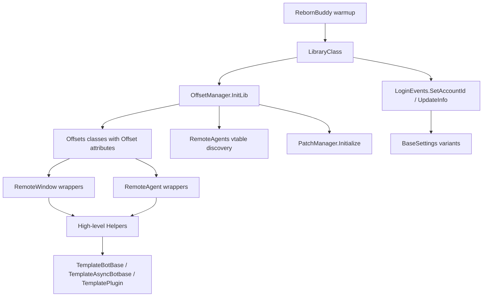
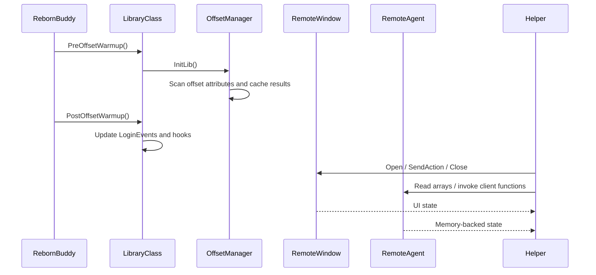

LlamaLibrary is organized as a layered support library. The bottom layer discovers and caches memory offsets, the middle layer exposes reusable wrappers over UI windows and agent pointers, and the top layer packages those primitives into botbase templates, settings, events, and task-oriented helpers such as navigation, housing travel, and Grand Company automation.

## Module Relationships

The entry point is `LibraryClass` in `LibraryClass.cs`. RebornBuddy calls `PreOffsetWarmup()` before normal bot execution. That method detects safe mode, installs a custom trace listener, and then awaits `OffsetManager.InitLib()`. `PostOffsetWarmup()` finishes the startup sequence by calling `OffsetManager.SetPostOffsets()`, `OffsetManager.SetScriptsThread()`, and `LoginEvents.UpdateInfo()`. This separation is deliberate: memory scanning must happen before higher-level systems assume valid addresses exist.

`OffsetManager` in `Memory/OffsetManager.cs` is the keystone. It discovers all types in the `LlamaLibrary.Memory` namespace whose name contains `Offsets`, reads the custom `[Offset(...)]` attributes, resolves patterns, and caches the results in a per-game-version JSON file such as `LL_Offsets_<gameVersion>.json`. That design makes repeated launches faster and isolates patch-sensitive logic from the rest of the API.

Above offsets, the library defines two UI access families:

- `RemoteWindow` classes in `RemoteWindows/` wrap visible game windows and mostly interact through `SendAction(...)`, `Open()`, `Close()`, and `WindowByName`.
- `RemoteAgents` classes in `RemoteAgents/` wrap agent pointers and vtables. These classes read memory directly from agent-owned structures and call client functions for lower-level behavior.

High-level helpers in `Helpers/` compose those primitives. `GrandCompanyShop.cs` combines `GrandCompanyExchange`, `AgentGrandCompanyExchange`, and data from `ResourceManager.GCShopItems`. `HousingTraveler.cs` combines `HousingHelper`, `WorldTravel`, `TeleportHelper`, and residential district definitions from `Helpers/HousingTravel/Districts/`. `GeneralFunctions.cs` acts as a broad utility layer for busy-state recovery, loot handling, crafting cleanup, and other orchestration tasks.

## Key Design Decisions

### Offset discovery is centralized

The library does not scatter signature scanning across individual helpers. `OffsetManager` owns discovery so patch-sensitive logic stays in one place. You can see this in `Memory/OffsetManager.cs`, where it filters types by namespace and `Offsets` naming convention before writing the shared cache. The advantage is obvious after game patches: update offset declarations first, then let higher-level code keep the same call sites.

### Window wrappers and agent wrappers are separated

`RemoteWindows/RemoteWindow.cs` deals with add-on visibility and action dispatch, while `RemoteAgents/*` deal with lower-level structures and vtables. The separation matters because some tasks only need a visible window and click actions, while others need raw arrays or hidden state that only an agent exposes. `GrandCompanyShop` is a good example: the window chooses categories, while the agent performs the actual item purchase call.

### Settings are scoped to runtime identity

`Settings/Base/BaseSettingsTyped.cs` provides generic settings singletons, but also character-, account-, and world-scoped variants. Those types subscribe to `LoginEvents.OnCharacterSwitched` where necessary and clear cached instances so consumers cannot accidentally keep writing one character's settings into another character's file.

### Helpers prefer composition over a giant service object

There is no monolithic `LlamaLibraryClient`. Instead, domain helpers compose each other directly. `Navigation.cs` defers to `HousingTraveler` for residential zones, `WorldTravel.WorldTravel` for cross-world hops, and `TeleportHelper` for aetheryte usage. That keeps call sites explicit and avoids a deep service locator pattern.

## Request and Data Lifecycle

From a consumer's perspective the normal lifecycle is:

1. RebornBuddy loads the library and runs `LibraryClass`.
2. Offsets are scanned or loaded from cache.
3. Optional hooks and login metadata are initialized.
4. Your botbase or plugin code uses template classes, settings, events, and helpers.
5. Helpers open windows, read agents, and perform actions until the task completes.

The rest of the docs follow that order because it matches the source code's actual dependency chain.
