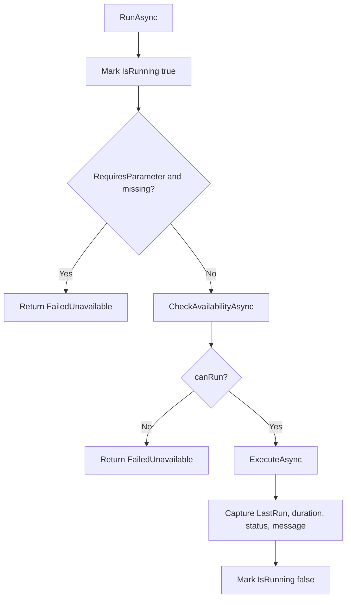

The `Helpers/CharacterSwitching/` folder is one of the most cohesive modern APIs in the repository. It provides a small extension surface for libraries that can enumerate characters, switch between them, and register reusable tasks that should run in a multi-character workflow.

## What It Is

`CharacterSwitcher` is a static integration hub. It does not implement character switching by itself. Instead, it defines delegates for:

- filling the character list,
- retrieving the current list,
- switching by character ID,
- and switching by `CharacterAvatar`.

It also exposes `CharacterTasks`, which is a read-only observable view over `CharacterTaskManager.Tasks`.

`CharacterTask` is the execution abstraction. Each task declares `Name`, `Description`, `ProvidingBotbaseName`, optional parameter metadata, and two core operations: `CheckAvailabilityAsync()` and `ExecuteAsync(...)`. The public `RunAsync()` method wraps those operations with parameter validation, availability checks, exception handling, result-state tracking, and property notifications.

`CharacterTaskManager` is the shared registry. It stores tasks in a `ConcurrentDictionary<string, CharacterTask>` keyed by `"ProvidingBotbaseName::TaskName"` and mirrors them into an `ObservableCollection<CharacterTask>`.

## Why It Exists

Different botbases can offer different character-switching capabilities. The library avoids hard-coding one implementation by making switching pluggable through delegates while still giving consumers a shared task catalog and common result model. That makes the API more reusable across a fragmented RebornBuddy ecosystem.

## How It Works Internally

The most important logic is inside `CharacterTask.RunAsync()` in `CharacterTask.cs`:



This is why consumers should override `ExecuteAsync` instead of reimplementing their own orchestration. The base class already standardizes:

- missing-parameter handling,
- translated fallback messages,
- successful and failed result bookkeeping,
- and exception-to-`CharacterTaskResult` conversion.

`CharacterAvatar` is a simple data model with computed names and world display helpers. The `Server` property uses `HomeWorld.WorldName()` from `Enums/World.cs`, while `DisplayName` can censor the character name when needed.

Basic example:

```csharp
using System.Threading.Tasks;
using LlamaLibrary.Helpers.CharacterSwitching;

public sealed class DailyResetTask : CharacterTask
{
    public override string Name => "Daily Reset";
    public override string Description => "Run a once-per-day maintenance pass.";
    public override string ProvidingBotbaseName => "MyBotbase";

    public override Task<(bool canRun, string reason)> CheckAvailabilityAsync()
        => Task.FromResult((true, string.Empty));

    protected override Task<CharacterTaskResult> ExecuteAsync(string? parameter = null)
        => Task.FromResult(new CharacterTaskResult(true, CharacterTaskResultStatus.Success, "Completed"));
}
```

Advanced example registering switching delegates and tasks:

```csharp
using System.Collections.Generic;
using System.Threading.Tasks;
using LlamaLibrary.Helpers.CharacterSwitching;

public void RegisterCharacterServices()
{
    CharacterSwitcher.FillCharacterListAsync = async () => true;
    CharacterSwitcher.GetCharacterList = () => new List<CharacterAvatar>();
    CharacterSwitcher.SwitchCharacterAsync = async characterId => true;
    CharacterSwitcher.SwitchCharacterByAvatarAsync = async avatar => true;

    CharacterSwitcher.AddCharacterTask(new DailyResetTask());
}
```

<Callout type="warn">Task identity is the pair of `ProvidingBotbaseName` and `Name`. `CharacterTaskManager` rejects duplicates with the same key. If your botbase registers tasks using unstable or user-editable names, you can create accidental collisions or make task removal unreliable.</Callout>

<Accordions>
<Accordion title="Why are switching operations delegates instead of concrete methods on CharacterSwitcher?">
The source is intentionally provider-agnostic. LlamaLibrary can define a shared switching contract without forcing one implementation strategy across all botbases and plugins. Delegates keep the integration surface minimal and let another library provide the real work only when that feature exists. The trade-off is discoverability: consumers must remember to assign the delegates before calling `IsCharacterSwitchingAvailable()` or trying to switch.
</Accordion>
<Accordion title="Why does CharacterTask own result-state tracking instead of leaving that to the UI layer?">
The base class stores `IsRunning`, `LastRun`, `LastRunDuration`, `LastRunStatus`, and `LastRunStatusMessage`, which makes tasks self-describing and easy to bind to a UI or status panel. That pushes a little more responsibility into the task abstraction, but it keeps every downstream botbase from reinventing the same bookkeeping. The pattern also makes failures more uniform because exceptions and availability problems are translated into the same `CharacterTaskResult` model. For shared libraries, that consistency is worth the extra fields.
</Accordion>
</Accordions>
