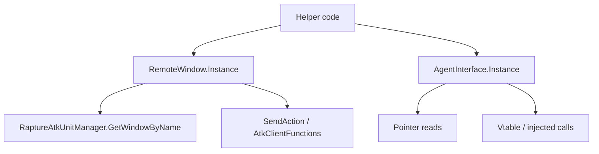

The dominant abstraction family in LlamaLibrary is its UI wrapper layer. Most concrete classes under `RemoteWindows/` and `RemoteAgents/` are thin adapters over game windows, add-on controls, agent pointers, and client-side arrays. If you understand the split between these two families, most of the rest of the library becomes predictable.

## What It Is

`RemoteWindow` in `RemoteWindows/RemoteWindow.cs` wraps visible UI add-ons identified by name. It exposes `IsOpen`, `WindowByName`, `Open()`, `Close()`, `WaitTillWindowOpen()`, and `SendAction(...)`. The generic subclass `RemoteWindow<T>` adds the common singleton pattern through `Instance`.

`IAgent` and the concrete classes in `RemoteAgents/` wrap agent pointers and vtables. Those classes usually inherit `AgentInterface<T>` from RebornBuddy, expose a `RegisteredVtable`, and then add pointer-backed properties or specialized methods such as `AgentGrandCompanyExchange.BuyItem`, `AgentFishGuide2.GetFishList`, or `AgentFreeCompanyChest.LoadBag`.

## Why It Exists

RebornBuddy gives you some remote-window and manager primitives, but many real workflows need more than "is this window open?" LlamaLibrary fills the gap by:

- mapping specific game windows to typed classes,
- turning opaque element arrays into named methods,
- exposing lower-level agents when the visible window does not contain enough state,
- and giving helper modules a stable interface to build on.

## How It Relates To Other Concepts

- `Runtime Bootstrap` supplies the offsets and vtable lookups that these wrappers need.
- `Guides` such as the Grand Company purchase flow combine a visible `RemoteWindow` with a lower-level agent wrapper.
- `Helpers` are almost always orchestration layers on top of these wrappers rather than separate systems.

## How It Works Internally

`RemoteWindow` reads the add-on by name through `RaptureAtkUnitManager.GetWindowByName(WindowName)`. The `Elements` property then dereferences internal element arrays using `Offset0` and `Offset2` offsets inside the add-on structure. That is why concrete windows like `GrandCompanyExchange` can do things like `Elements[1].TrimmedData` without knowing how the array is discovered.

Concrete window wrappers add behavior on top of that base. For example:

- `RemoteWindows/GrandCompanyExchange.cs` exposes `ChangeRankGroup(int rankGroup)` and `ChangeItemGroup(int itemGroup)` by encoding specific `SendAction` sequences.
- `RemoteWindows/FishGuide2.cs` exposes `ClickTab`, `SelectFishing`, and `SelectSpearFishing`.
- `RemoteWindows/RetainerList.cs` reads `OrderedRetainerList`, then composes UI clicks and dialogue progression in `SelectRetainer(...)`.

Agents go deeper. `RemoteAgents/AgentFishGuide2.cs` reads pointer chains to build a list of `FishGuide2Item` structs. `RemoteAgents/AgentGrandCompanyExchange.cs` calls the underlying buy function directly. `RemoteAgents/AgentFreeCompany.cs` reads free-company roster memory and action lists that are not conveniently exposed by window elements alone.



Basic example:

```csharp
using System.Threading.Tasks;
using LlamaLibrary.RemoteWindows;

public async Task<bool> OpenAndCloseGcWindowAsync()
{
    if (!await GrandCompanyExchange.Instance.Open())
    {
        return false;
    }

    GrandCompanyExchange.Instance.ChangeItemGroup(1);
    GrandCompanyExchange.Instance.Close();
    return true;
}
```

Advanced example combining window and agent access:

```csharp
using System.Linq;
using System.Threading.Tasks;
using LlamaLibrary.RemoteAgents;
using LlamaLibrary.RemoteWindows;

public async Task<uint[]> ReadCurrentGcTurninItemsAsync()
{
    if (!await GrandCompanyExchange.Instance.Open())
    {
        return new uint[0];
    }

    GrandCompanyExchange.Instance.ChangeRankGroup(1);
    var items = GrandCompanyExchange.Instance.GetTurninItemsIds();
    var currentRank = AgentGrandCompanyExchange.Instance.Rank;
    return currentRank >= 0 ? items.ToArray() : new uint[0];
}
```

<Callout type="warn">Most concrete `RemoteWindow` classes encode element indices and action payloads that are patch-sensitive. If a method suddenly stops selecting the intended UI element after a game update, do not assume the helper logic is wrong first; check the corresponding wrapper file and the underlying offsets.</Callout>

<Accordions>
<Accordion title="Why not expose one giant generic UI object instead of many wrapper classes?">
The source intentionally prefers many small wrappers because each in-game window has different element layouts and action payloads. A single dynamic object would reduce compile-time safety and move more logic into consumer code. With the current design, `RetainerList`, `GrandCompanyExchange`, and `FishGuide2` can each encode the exact payloads they need close to the source file where they are maintained. The trade-off is breadth: there are many classes, but most are shallow and easy to patch.
</Accordion>
<Accordion title="When should you use an agent instead of only the window wrapper?">
Use the window wrapper when visibility and click-style actions are enough, because that path is easier to reason about and usually more stable. Reach for an agent when the visible add-on does not expose enough information, when you need pointer-backed arrays, or when the client function already exists and is cleaner than simulating UI clicks. `GrandCompanyShop` is a good example of this trade-off: the window chooses groups, but the agent actually executes purchases. That extra power comes with a higher maintenance cost because agent structures tend to be more offset-sensitive.
</Accordion>
</Accordions>
