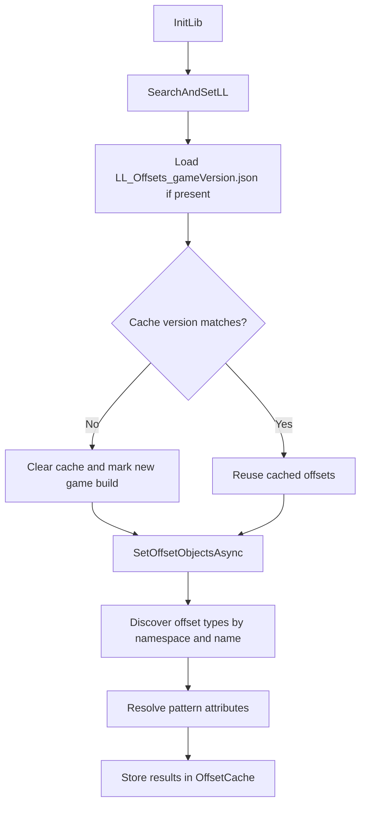

Runtime bootstrap is the first concept to understand because almost every other API assumes the library has already resolved offsets and captured the current account and character context. In source terms, the bootstrap path lives mainly in `LibraryClass.cs` and `Memory/OffsetManager.cs`.

## What It Is

`LibraryClass` implements `ILibrary`, the RebornBuddy extension point that runs during warmup. Its `PreOffsetWarmup()` method checks command-line arguments for `-safemode`, also enables safe mode if the user holds `Shift` and `Ctrl`, ensures the custom `LLoggerTraceListener` exists, and finally awaits `OffsetManager.InitLib()`. `PostOffsetWarmup()` then finalizes runtime state by calling `OffsetManager.SetPostOffsets()`, `OffsetManager.SetScriptsThread()`, `LoginEvents.SetAccountId()`, and `LoginEvents.UpdateInfo()`.

This concept exists to solve a very specific problem: helpers such as `TeleportHelper`, `RemoteWindow`, or `AgentGrandCompanyExchange` cannot safely operate until the library has located the current memory addresses for the installed game build. If you skip bootstrap, the higher layers may still compile, but they will be working from missing or stale pointers.

## How It Relates To Other Concepts

- `Remote UI Abstractions` depend on offset discovery because they use `Core.Memory` reads and action dispatch.
- `Settings and Events` depend on `LoginEvents.SetAccountId()` and `UpdateInfo()` to choose the correct settings scope.
- `Character Switching` relies on those same login events to invalidate character-scoped singletons when the active avatar changes.

## How It Works Internally

`OffsetManager.InitLib()` in `Memory/OffsetManager.cs` is the main worker. The flow is:



A few implementation details are worth calling out:

- Region handling is built into the static constructor. `ActiveRegion` is chosen from `DataManager.CurrentLanguage`, and `ActiveRecord` binds that region to a specific supported game version.
- Offset types are discovered reflectively by filtering for classes under `LlamaLibrary.Memory` whose name contains `Offsets`. This means adding a new offset container is mostly declarative.
- Cache files are stored under `JsonSettings.SettingsPath` and keyed by the current game version, which keeps mismatched versions from silently reusing stale data.

Basic example:

```csharp
using LlamaLibrary;

public async Task<bool> InitializeLibraryAsync(ILibrary library)
{
    var llama = (LibraryClass)library;
    var preOk = await llama.PreOffsetWarmup();
    var postOk = await llama.PostOffsetWarmup();
    return preOk && postOk;
}
```

Advanced example, mirroring the built-in safe-mode behavior:

```csharp
using LlamaLibrary;

public bool RunningWithReducedBehavior()
{
    return LibraryClass.SafeMode;
}
```

<Callout type="warn">Do not assume the NuGet package version is the runtime truth. The README and `LibraryClass` bootstrap path make it clear that the actual runtime copy is the one installed in `QuestBehaviors\__LlamaLibrary`. If a user has an older runtime folder than your compile-time package, offset-sensitive code can behave differently.</Callout>

<Accordions>
<Accordion title="Why cache offsets instead of scanning on every call?">
The source favors a shared cache because repeated pattern scanning would make startup slower and would scatter patch-sensitive work throughout the library. `OffsetManager` already knows the current game version and writes `LL_Offsets_<gameVersion>.json`, so the cost is paid once and reused across sessions. The trade-off is cache invalidation: the code has to track its own `_version` constant and clear the cache when the expected schema changes. That is still cheaper and safer than letting every helper perform ad hoc scans.
</Accordion>
<Accordion title="Why split pre-offset and post-offset warmup?">
The split mirrors the actual dependency order in the source. `PreOffsetWarmup()` is responsible for making the memory layer usable, while `PostOffsetWarmup()` attaches login and hook-related behavior that depends on the first stage having succeeded. If everything were done in one undifferentiated method, failures would be harder to isolate and the library would blur the line between low-level discovery and higher-level lifecycle wiring. The current structure keeps those responsibilities separate and easier to debug.
</Accordion>
</Accordions>
