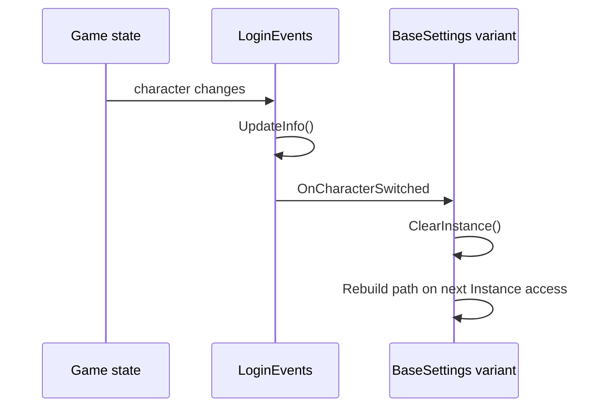

LlamaLibrary treats persisted settings and login lifecycle as first-class runtime concerns. That is necessary because many automation projects need data that should survive restarts but should still be scoped correctly to an account, character, or home world. The relevant source lives in `Settings/Base/`, `Settings/LlamaLibrarySettings.cs`, `Helpers/JsonHelper.cs`, and `Events/LoginEvents.cs`.

## What It Is

`BaseSettings` is the core persisted-settings abstraction. It loads defaults from `[DefaultValue]` attributes, populates the object from JSON if a file exists, attaches change listeners for nested collections and child objects, and saves changes back to disk using a debounced dispatcher. `BaseSettings<T>` adds the standard singleton `Instance` pattern, and the derived variants change the file path strategy:

- `CharacterBaseSettings<T>` stores data under a `Name_PlayerId` folder and clears the singleton on character switch.
- `AccountBaseSettings<T>` stores data by account ID.
- `HomeWorldBaseSettings<T>` stores data by the current home world and also resets on character switch.

`LoginEvents` publishes `OnLogin`, `OnDisconnected`, and `OnCharacterSwitched` events, along with `AccountId`, `PreviousCharacterId`, and `LastKnownCharacterId`.

## Why It Exists

Without these abstractions, each botbase or plugin would have to invent its own file layout, save throttling, and character switch invalidation. The library solves those problems once and keeps them consistent across projects. `Helpers/JsonHelper.cs` reinforces the same convention by exposing folder helpers such as `UniqueCharacterSettingsDirectory`, `HomeWorldSettingsDirectory`, and `DataCenterSettingsDirectory`.

## How It Works Internally

`BaseSettings` loads in three phases:

1. Apply `[DefaultValue]` attributes to properties.
2. If the target file exists, call `JsonConvert.PopulateObject(...)`.
3. Attach change tracking to `INotifyCollectionChanged`, `IBindingList`, and nested `INotifyPropertyChanged` properties so future modifications trigger `Save()`.

`Save()` does not write immediately. Instead, `_saveDebounceDispatcher.Debounce(500, ...)` delays disk writes so chatty UI updates or list changes do not spam the filesystem. The file path itself is computed through `GetSettingsFilePath(...)`, which anchors everything under `JsonSettings.SettingsPath`.

`LoginEvents` uses three `DebounceDispatcher` instances as well. The public `InvokeOnLogin`, `InvokeOnDisconnected`, and `InvokeOnCharacterSwitched` methods can either fire immediately when `force` is `true` or debounce by one second. `InvokeOnCharacterSwitched()` also calls `UpdateInfo()` first so downstream subscribers see fresh IDs.



Basic example:

```csharp
using System.ComponentModel;
using LlamaLibrary.Settings.Base;

public sealed class MyPluginSettings : CharacterBaseSettings<MyPluginSettings>
{
    private bool _enabled;

    [DefaultValue(true)]
    public bool Enabled
    {
        get => _enabled;
        set => SetField(ref _enabled, value);
    }
}
```

Advanced example with lifecycle subscription:

```csharp
using LlamaLibrary.Events;

public void WireLoginEvents()
{
    LoginEvents.OnCharacterSwitched += (_, args) =>
    {
        ff14bot.Helpers.Logging.Write(
            $"Character changed from {args.LastKnownCharacterId} to {args.NewCharacterId}");
    };
}
```

<Callout type="warn">Choose the settings base class that matches your isolation boundary. If you use `BaseSettings<T>` for data that should be per-character, the singleton will survive character switches and you can silently load or overwrite the wrong file. The source already provides character, account, and home-world variants so you do not have to improvise this.</Callout>

<Accordions>
<Accordion title="Why debounce settings saves instead of writing synchronously on every property change?">
The source observes not only primitive property setters but also collection changes and nested property changes. In a UI-heavy botbase or plugin, that can produce bursts of updates that would translate into excessive disk writes if every change were flushed immediately. Debouncing protects performance and reduces the chance of writing half-updated state during rapid UI interaction. The trade-off is that the most recent changes may wait a few hundred milliseconds before landing on disk.
</Accordion>
<Accordion title="Why are login events also debounced?">
In the actual runtime environment, game and UI state can bounce through intermediate states during loading, zoning, or reconnect flows. Debouncing the public event surface helps consumers react to the stable end of a transition instead of every transient edge. That makes settings invalidation and plugin callbacks easier to reason about. The cost is slightly delayed notification, but the library clearly allows `force: true` when a caller needs immediate delivery.
</Accordion>
</Accordions>
